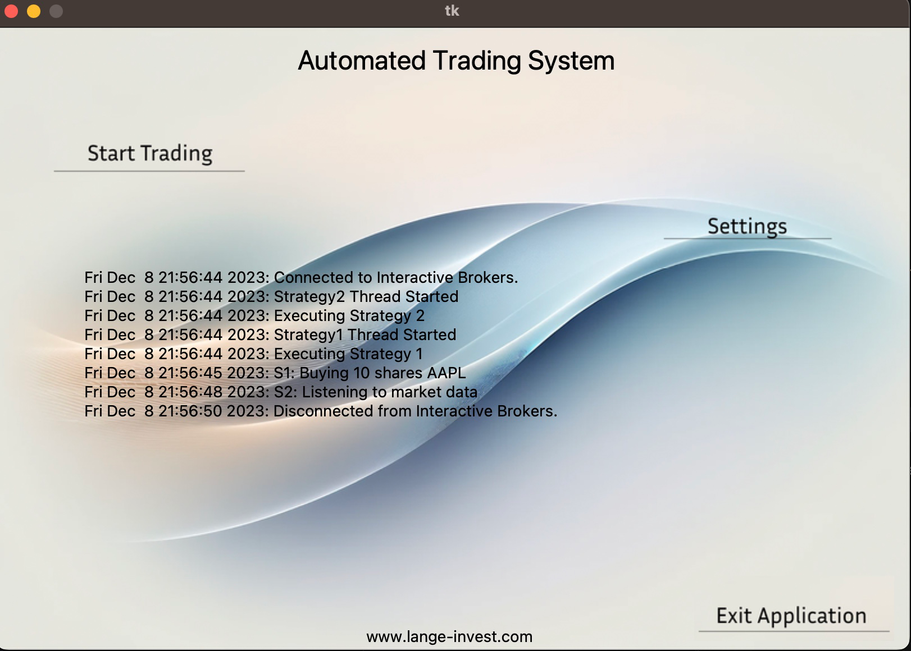

# IB-Multi-Strategy-ATS

An Automated Trading System (ATS) for managing and executing multiple trading strategies via Interactive Brokers (IB). This ATS leverages ib_insync for efficient and easy trading with IB, and uses ArcticDB for robust and scalable storage of strategy cash flow and P&L data.



## Summary

**IB-Multi-Strategy-ATS** is an Automated Trading System (ATS) designed to manage and execute multiple trading strategies seamlessly through Interactive Brokers (IB). Leveraging the power of `ib_async` for efficient trading and `ArcticDB` for robust data storage, this system empowers traders to optimize their strategies with a user-friendly graphical interface.

## Features

- **Multiple Strategy Management:** Run and monitor multiple trading strategies simultaneously.
- **Interactive Brokers Integration:** Utilize `ib_async` for a smooth and powerful connection with IB's trading API.
- **ArcticDB for Data Storage:** Robust and scalable storage solution for strategy cash flow and P&L data.
- **User-Friendly GUI:** Intuitive interface for managing settings, strategies, and real-time portfolio monitoring.
- **Customizable Strategy Parameters:** Tailor strategies with user-defined parameters to fit specific trading needs.
- **Database Management:** Browse through ArcticDB data and schedule cron jobs directly from the GUI.
- **Research Tools:** Integrated research modules to aid in strategy development and analysis.

## Installation

### Prerequisites

- **Python 3.8+**
- **Interactive Brokers Account**
- **Trader Workstation (TWS) or IB Gateway**

### Steps

1. **Clone the Repository**
   ```bash
   git clone https://github.com/lowQuant/IB-Multi-Strategy-ATS.git
   cd IB-Multi-Strategy-ATS
   ```

2. **Create a Virtual Environment**
   ```bash
   python -m venv venv
   source venv/bin/activate  # On Windows: venv\Scripts\activate
   ```

3. **Install the Package in Editable Mode**
   ```bash
   pip install -e .
   ```

   *This allows you to modify the codebase and have changes reflected without reinstalling.*

## Usage

After installation, you can run the application using:
```bash
python main.py
```


Upon launching the application, the GUI initializes ArcticDB automatically and provides various controls to interact with the ATS.

## GUI Documentation

### Settings

Configure application settings, including API credentials, trading parameters, and strategy preferences.


**Key Functions:**
- Manage strategies
- Set risk parameters
- Configure notifications

### Portfolio

Monitor your portfolio in real-time, view positions, asset classes, market prices, and P&L metrics.


**Key Functions:**
- View current holdings
- Analyze performance metrics
- Update or adjust positions

### Database

Explore and manage your ArcticDB data. Browse through stored data, perform queries, and schedule automated data processing jobs.


**Key Functions:**
- Browse data collections
- Schedule cron jobs
- Export and import data

### Research

Utilize integrated research tools to develop, test, and analyze new trading strategies.


**Key Functions:**
- Backtest strategies
- Analyze market data
- Develop custom indicators

### Start Trading

Initiate trading operations by connecting to Interactive Brokers and selecting desired strategies to deploy.


**Key Functions:**
- Connect to IB
- Select and deploy strategies
- Monitor real-time trading activities

*Note: Replace the screenshot placeholders with actual images from your application.*

## Main Components

### StrategyManager

The `StrategyManager` is responsible for handling multiple trading strategies. It dynamically loads, manages, and executes strategies based on user interactions and market conditions.

### PortfolioManager

The `PortfolioManager` interfaces with Interactive Brokers to retrieve and manage portfolio data. It leverages `ArcticDB` to store and analyze strategy performance, offering robust data persistence and querying capabilities.

**Integration with ArcticDB:**
- **Data Storage:** Stores cash flow, positions, and P&L data.
- **Data Retrieval:** Efficiently queries and aggregates data for analysis.
- **Scalability:** Handles large datasets with ease, ensuring smooth performance.

## Roadmap

- **Strategy Creation:** Add some pre-built strategies.
- **Ask an AI:** Allow the user to ask an AI to create a strategy and get some suggestions which strategies can potentially fill the trader's potholes given the existing set of strategies.
- **Auto Start:** Work on the auto start feature.
- **Automated Reporting:** Generate and schedule automated performance reports.
- **Strategy Backtests:** Create a backtesting feature for strategies. This way the trader can compare actual performance vs. backtested performance and check strategy degradation.

## Contributing

Contributions are welcome! Please fork the repository and submit a pull request for any enhancements or bug fixes.

1. **Fork the Repository**
2. **Create a Feature Branch**
   ```bash
   git checkout -b feature/YourFeature
   ```
3. **Commit Your Changes**
   ```bash
   git commit -m "Add Your Feature"
   ```
4. **Push to the Branch**
   ```bash
   git push origin feature/YourFeature
   ```
5. **Open a Pull Request**

Please ensure your code follows the project's coding standards and includes appropriate tests.

## License

This project is licensed under the [MIT License](LICENSE).
